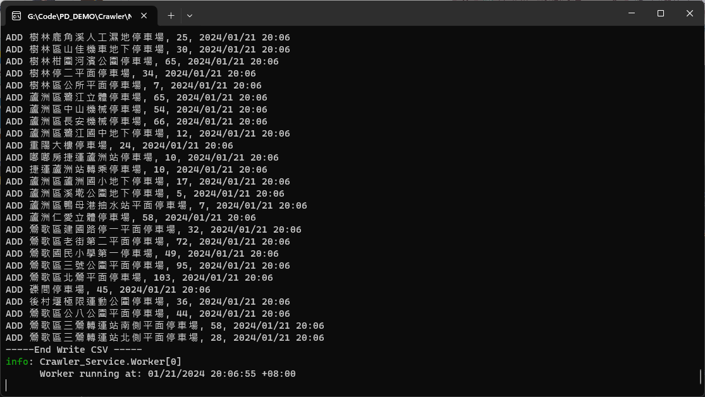

# 停車場資料爬蟲服務

這是一個利用 .NET Core Worker Service 開發的爬蟲程式，專門用於抓取停車場的即時車位數據，並將數據轉換為CSV檔案格式存儲。

## 程式優點

- **自動化運行**：程式會定時抓取資料，完全自動化，無需手動操作。
- **數據即時更新**：可依設定的時間間隔持續更新停車場車位數據。
- **資料結構化**：將抓取的資料整理成結構化的CSV格式，方便後續分析使用。
- **高效率**：利用 AngleSharp 快速解析HTML，提高數據處理效率。
- **易於擴展**：程式碼結構清晰，易於添加新的功能或修改現有功能。

## 使用說明

1. 確保您的系統已安裝 .NET Core 3.1 或以上版本。
2. 下載並解壓程式碼到您的本機開發環境。
3. 開啟終端機，導航至程式碼所在目錄。
4. 執行 `./Crawler_Service/bin/Debug/netcoreapp3.1/Crawler_Service.exe` 啟動服務。
5. 程式將自動開始抓取數據並每隔一定時間更新CSV檔案。
6. CSV檔案將會被儲存於 `./Crawler_Service/GetData` 目錄下。

## 檔案結構

- CSV檔案包含以下欄位：
  - `停車場名稱`：停車場的名稱。
  - `剩餘車位`：停車場剩餘的車位數量。
  - `紀錄時間`：數據抓取的時間。

## 配置設定

- 程式會依據 `appsettings.json` 中配置的URL進行數據抓取。
- 您可以修改 `appsettings.json` 中的 `URL`、`directoryName` 和 `fileName` 來自定義抓取設定。

## 支援與貢獻

如果您有任何問題或建議，歡迎通過Issues提出，或直接進行Pull Request貢獻您的代碼。

## 授權

本爬蟲服務採用 MIT 授權協議，詳情請參閱授權檔案。
